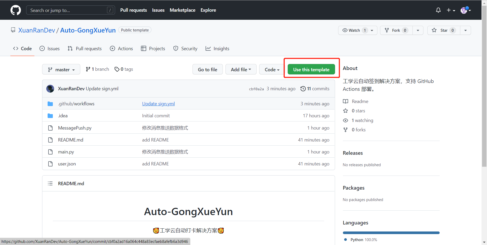
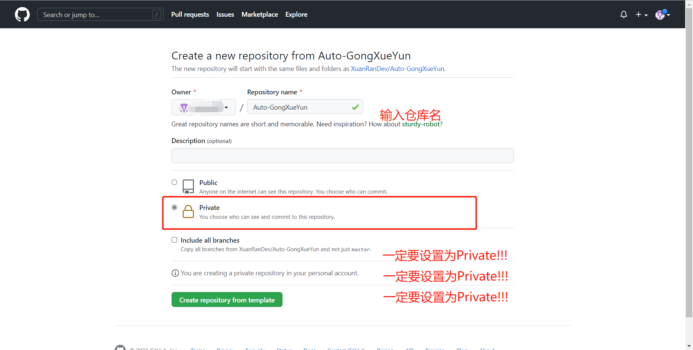
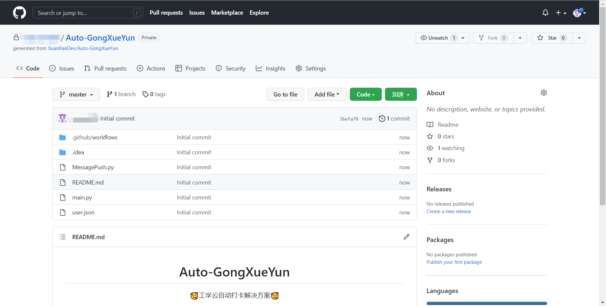
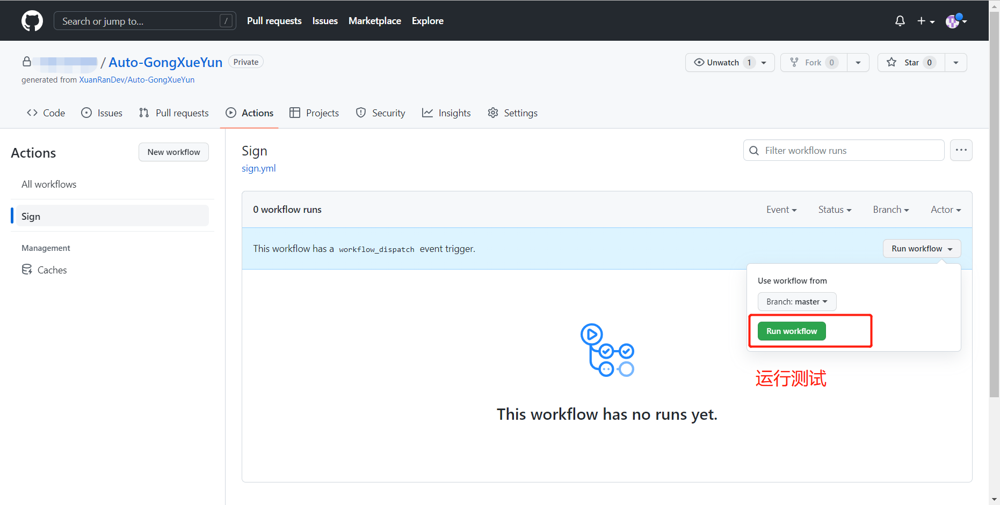
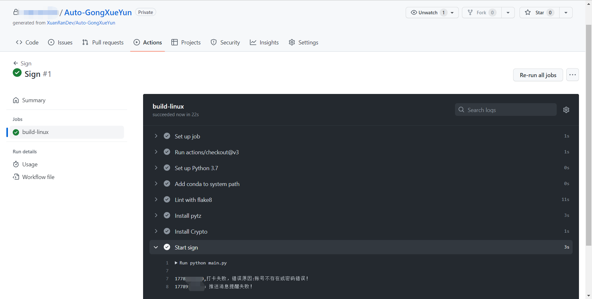
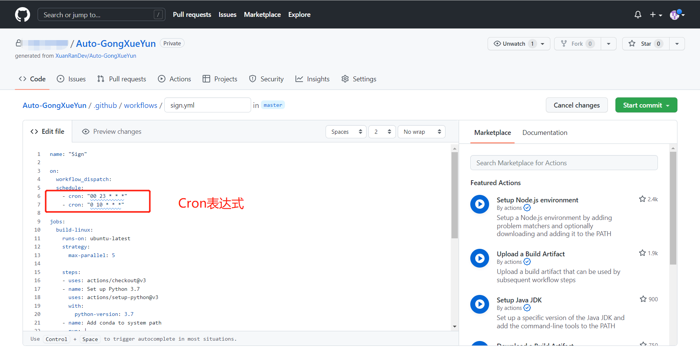

<div align="center">
<h1 align="center">
Auto-GongXueYun
</h1>
<p align="center">
🥰工学云自动打卡解决方案🥰
</p>
</div>


## 项目介绍
工学云每日上下班打卡，支持多账号，指定地区，PushPlus打卡结果推送，整个工程只有两个Python文件以及一个user.json配置文件，十分简单、轻量。😍


## 使用方法

Github Actions

推荐指数：⭐⭐⭐⭐⭐

优点：适合没有自己服务器的人使用。

缺点：每日打卡时间无法保证十分准时，拥有10-30分钟的误差。


1.点击Use this template使用模板🤪




2.设置仓库相关信息😯




3.稍等一会就能生成一个仓库了😴




4.编辑user.json配置文件🤔

如果是只有一个用户就把多余的用户2给删掉。

其中经纬度可以通过高德坐标拾取来完成，[传送门](https://lbs.amap.com/tools/picker)

消息推送的使用pushPlus，请到官网绑定微信（[传送门](https://www.pushplus.plus/)），然后在发送消息里面把你的token复制出来粘贴到pushKey这项

```json
[
  {
    "phone": "用户1手机号",
    "password": "用户1密码",
    "token": "什么也不填",
    "country": "中国",
    "province": "省份",
    "city": "哪个市",
    "type": "设备类型（android 或 ios）",
    "address": "签到地址",
    "latitude": "纬度",
    "longitude": "精度",
    "pushKey": "推送Key"
  },
  {
    "phone": "用户2手机号",
    "password": "用户2密码",
    "token": "什么也不填",
    "country": "中国",
    "province": "所在省份",
    "city": "所在市",
    "type": "设备类型（android 或 ios）",
    "address": "签到地址",
    "latitude": "纬度",
    "longitude": "精度",
    "pushKey": "推送Key"
  }

]
```


5.在Actions里面运行Sign进行测试，查看是否能够打卡成功以及消息是否成功推送。🤤






至此，自动打卡将会在每天7点和18点左右自动运行打卡。😉


## 修改自动打卡时间🎯	

修改自动打卡时间需要了解Cron表达式的使用。😴


1.编辑sign.yml文件，找到图中我圈出的部分




2.编辑表达式

GitHub的cron表达式不支持精准到秒，所以从最左边开始，分别为：

分钟 小时 日 月份 星期

而且Github的服务器时间会比我们晚八个小时，所以在你需要打卡的时间-8配置到里面就行了


例如说在上午十点打上班卡就是:

```yml
- cron: "00 2 * * *"
```


晚上九点打下班卡：

```yml
- cron: "00 13 * * *"
```


最后，帮我点下仓库的小星星，Thanks.


😀😀😀😀😀
